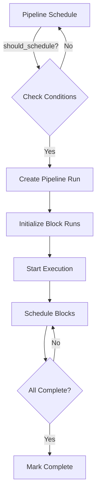

Mage provides a powerful orchestration system for scheduling and executing data pipelines. The orchestration layer manages pipeline runs, triggers, sensors, and backfills.

## Core Concepts

### Pipeline Schedules

A **Pipeline Schedule** is a trigger configuration that determines when and how a pipeline should execute. Each schedule has:

- **Name**: Unique identifier for the trigger
- **Schedule Type**: Time-based, event-based, or API-triggered
- **Schedule Interval**: Frequency of execution (for time-based triggers)
- **Status**: Active or inactive
- **Variables**: Runtime variables passed to the pipeline
- **SLA**: Service Level Agreement timeout (in seconds)

### Pipeline Runs

A **Pipeline Run** represents a single execution of a pipeline. Pipeline runs track:

- Execution date and time
- Status (initial, running, completed, failed, cancelled)
- Block runs (individual block executions)
- Variables and event data
- Metrics and performance data

### Schedule Types

Mage supports three types of triggers:

<CardGroup cols={3}>
  <Card title="Time Triggers" icon="clock">
    Schedule pipelines to run at specific times or intervals using cron expressions
  </Card>
  <Card title="Event Triggers" icon="bolt">
    Trigger pipelines based on external events like S3 uploads or AWS EventBridge
  </Card>
  <Card title="API Triggers" icon="code">
    Manually trigger pipelines via API calls or from other pipelines
  </Card>
</CardGroup>

## Schedule Intervals

For time-based triggers, Mage provides predefined intervals:

- `@once` - Run once
- `@hourly` - Every hour
- `@daily` - Every day at midnight
- `@weekly` - Every week on Sunday
- `@monthly` - First day of every month
- `@always_on` - Continuously running (for streaming pipelines)
- Custom cron expressions - Full flexibility

## Database Models

The orchestration system uses SQLAlchemy models stored in the Mage database:

```python
# Key models in mage_ai.orchestration.db.models.schedules

class PipelineSchedule(BaseModel):
    """Trigger configuration for a pipeline"""
    name: str
    pipeline_uuid: str
    schedule_type: ScheduleType  # TIME, EVENT, or API
    schedule_interval: str
    status: ScheduleStatus  # ACTIVE or INACTIVE
    start_time: datetime
    variables: dict
    sla: int  # seconds
    settings: dict

class PipelineRun(BaseModel):
    """A single execution of a pipeline"""
    pipeline_schedule_id: int
    pipeline_uuid: str
    execution_date: datetime
    status: PipelineRunStatus
    variables: dict
    metrics: dict
    block_runs: List[BlockRun]
```

## Orchestration Architecture

### Scheduler Loop

The `PipelineScheduler` runs continuously to:

1. Check which pipeline schedules should trigger
2. Create new pipeline runs for active schedules
3. Enforce concurrency limits and run limits
4. Start pipeline runs and schedule block executions
5. Monitor running pipelines and check SLAs

### Execution Flow



## Settings Configuration

Schedule settings control pipeline execution behavior:

```python
class SettingsConfig:
    skip_if_previous_running: bool = False
    allow_blocks_to_fail: bool = False
    create_initial_pipeline_run: bool = False
    landing_time_enabled: bool = False
    pipeline_run_limit: int = None
    timeout: int = None  # seconds
    timeout_status: str = None
```

### Key Settings

<Accordion title="skip_if_previous_running">
  Prevent new runs from starting if a previous run is still in progress. Useful for long-running pipelines.
</Accordion>

<Accordion title="allow_blocks_to_fail">
  Allow the pipeline to continue executing even if some blocks fail. The pipeline will be marked as failed but downstream blocks may still run.
</Accordion>

<Accordion title="pipeline_run_limit">
  Maximum number of concurrent pipeline runs for this schedule. Additional runs will be cancelled.
</Accordion>

<Accordion title="landing_time_enabled">
  Adjust execution timing based on historical runtime to ensure pipelines complete by the scheduled time.
</Accordion>

## Running Pipelines

### Via CLI

```bash
# Run a pipeline once
mage run [project_path] [pipeline_uuid]

# Run with runtime variables
mage run [project_path] [pipeline_uuid] \
  --runtime-vars '{"key": "value"}'

# Run a specific block
mage run [project_path] [pipeline_uuid] \
  --block-uuid my_block

# Skip sensors
mage run [project_path] [pipeline_uuid] --skip-sensors
```

### Via API

```python
from mage_ai.orchestration.triggers.api import trigger_pipeline

# Trigger a pipeline
pipeline_run = trigger_pipeline(
    pipeline_uuid='my_pipeline',
    variables={'env': 'production'},
    check_status=False,  # Don't wait for completion
)

# Trigger and wait for completion
pipeline_run = trigger_pipeline(
    pipeline_uuid='my_pipeline',
    variables={'date': '2024-01-01'},
    check_status=True,
    poll_interval=60,  # Check every 60 seconds
    error_on_failure=True,
)
```

### From Another Pipeline

```python
from mage_ai.orchestration.triggers.api import trigger_pipeline

if 'data_exporter' not in globals():
    from mage_ai.data_preparation.decorators import data_exporter

@data_exporter
def trigger_downstream_pipeline(*args, **kwargs):
    # Trigger another pipeline when this one completes
    pipeline_run = trigger_pipeline(
        'downstream_pipeline',
        variables={'upstream_date': kwargs['execution_date']},
    )
    return {'pipeline_run_id': pipeline_run.id}
```

## Monitoring

The orchestration system provides:

- **Pipeline run logs** - Execution logs for each run
- **Block run logs** - Individual block execution logs
- **Metrics** - Runtime statistics and performance data
- **SLA monitoring** - Alerts when pipelines exceed SLA
- **Status tracking** - Real-time status of all runs

<Note>
See the [Monitoring](/orchestration/monitoring) page for detailed information on monitoring pipeline runs.
</Note>

## Next Steps

<CardGroup cols={2}>
  <Card title="Triggers" icon="calendar" href="/orchestration/triggers">
    Configure time, event, and API triggers
  </Card>
  <Card title="Sensors" icon="tower-broadcast" href="/orchestration/sensors">
    Wait for external conditions before executing
  </Card>
  <Card title="Backfills" icon="clock-rotate-left" href="/orchestration/backfills">
    Run pipelines for historical date ranges
  </Card>
  <Card title="Monitoring" icon="chart-line" href="/orchestration/monitoring">
    Monitor and troubleshoot pipeline runs
  </Card>
</CardGroup>
